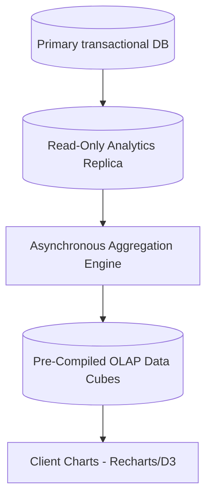

# Aurelia Ops Enterprise Analytics, Reporting, and Predictive Intelligence

This document details the official architectural specification for **Aurelia Ops Analytics Engines, Interactive Dashboards, Trend Analysis, and Anomaly Detection Systems**. It outlines how data is gathered, aggregated, and modeled to deliver high-fidelity insights to enterprise administrators.

---

## 1. Multi-Tier Real-Time Analytics Architecture (13.1)

Aurelia Ops implements a decoupled telemetry pipeline, keeping expensive analytical operations isolated from our primary API database threads to ensure high performance on transactional operations.

### 1.1 Analytics Pipeline Topology


To optimize performance, live transaction databases stream updates to read-only replica instances. Our background reporting engines compile these updates into high-efficiency data formats on a scheduled basis, allowing complex queries to compile in sub-50ms.

---

## 2. Pre-Compiled Metrics & Performance Analytics Formulas

Our analytics engines compile SLA metrics, queue performance statistics, and user satisfaction ratings hourly:

### 2.1 First Response Time (FRT)
The chronological duration from ticket creation to either the first formal agent reply or automatic AI categorization:

$$\text{FRT} = t_{\text{First Agent Action}} - t_{\text{Ticket Creation}}$$

### 2.2 SLA Compliance Percentage
The ratio of tickets closed within their configured SLA resolution deadline relative to total tickets closed in the evaluated window:

$$\text{SLA Compliance \%} = \left( \frac{N_{\text{SLA Met}}}{N_{\text{Total Tickets Resolved}}} \right) \times 100$$

### 2.3 Customer Satisfaction Score (CSAT)
Evaluated continuously by requesting feedback on resolved issues:

$$\text{CSAT Score \%} = \left( \frac{\sum \text{Ratings}}{\text{Max Rating Value} \times N_{\text{Total Feedback Samples}}} \right) \times 100$$

---

## 3. Custom Report Generation & Multi-Format Exports

Administrators can build customized, multi-dimensional queries. They can select dimension coordinates, filter parameters, and configure export tasks.

- **Dynamically Custom Query Builder**: Provides users with dropdowns to map ticket attributes to data dimensions (e.g. grouping average response times by workspace, agent, or customer segment).
- **Scheduled Email Reports**: Background task managers schedule recurring telemetry delivery, executing analytical aggregations and dispatching PDF or XLSX summaries to stakeholder email addresses:
  ```typescript
  export interface ScheduledReportTask {
    id: string;
    workspaceId: string;
    recipientEmails: string[];
    cronSchedule: string; // e.g. "0 9 * * 1" for Monday Morning meetings
    metricsScope: ("sla" | "csat" | "volume" | "backlog")[];
    exportFormat: "pdf" | "xlsx" | "csv";
  }
  ```

---

## 4. Operational Trend Analysis & Anomaly Detection

To assist managers with capacity allocation and help identify system anomalies, the platform implements localized trend smoothing and alerts.

### 4.1 Exponentially Weighted Moving Average (EWMA)
We use smoothed trends to filter out single-day spikes and focus on real growth patterns:

$$S_t = \alpha \cdot Y_t + (1 - \alpha) \cdot S_{t-1}$$

Where:
- $S_t$ is the smoothed trend value for day $t$.
- $Y_t$ is the raw ticket inflow volume for day $t$.
- $\alpha$ is our smoothing factor coefficient (typically configured to $0.15$).

### 4.2 Anomaly Detection Trigger Rules
- **Volume Spike Warning**: If ticket creation volumes on high-priority queues diverge from historical baselines by more than `2.5` standard deviations ($\sigma > 2.5$) over a rolling 3-hour window, the system automatically triggers a volume anomaly alert.
- **SLA Violation Trend Alert**: If average resolution times climb past historical target averages by more than `30%`, an alert is dispatched, notifying managers to review on-call rosters or reallocate agent capacities.
