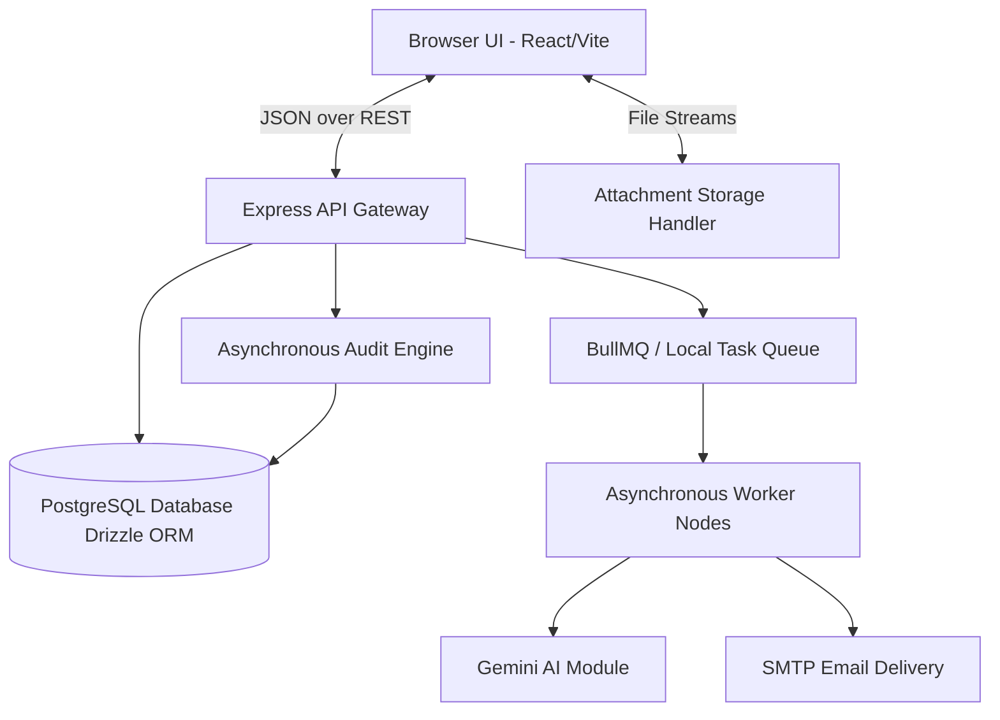
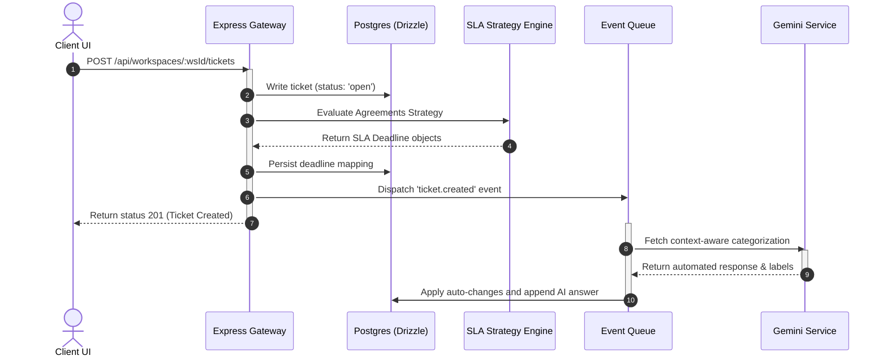
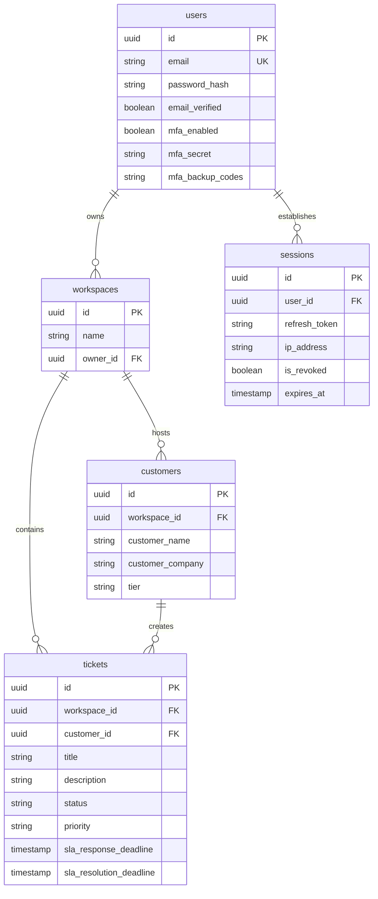

# Aurelia Ops System Architecture, Design Patterns, and Diagrams

This document contains the official architectural specification of the **Aurelia Ops** platform. It provides developers, operations teams, and security auditors with a deep technical blueprint of how systems interact, persist data, scaling rules, security gates, and failover topologies.

---

## 1. System Block Architecture Diagram

Aurelia Ops uses a decoupled full-stack model pairing a client-side Single-Page Application (React, Vite) with an asynchronous Express.js API gateway backend and a multi-agent automated worker system.



---

## 2. Component Interaction & Flow Diagrams

### 2.1 Ticket Lifecycle & Automation Execution Flow
This diagram details the sequence of events when a customer files a ticket, triggering SLA analysis and AI classification.



---

## 3. Database Entity-Relationship (ER) Diagram

Aurelia Ops uses PostgreSQL mapped strictly via Drizzle ORM. The relational grid preserves referential integrity with cascading deleted references.



---

## 4. Comprehensive Security Architecture

Aurelia Ops implements a rigorous, multi-layered security blueprint:
- **Argon2id Passwords Protection**: Standardizes hashing configurations: $m=65536, t=3, p=4$ utilizing custom salt-blocks to prevent brute-forcing.
- **Durable Sessions Revocation (JTI check)**: Refresh tokens map to unique JTI entries in the database. During key renewal requests, the token validation system asserts if the database token was revoked, protecting against theft of long-lived keys.
- **Automated Panic Access Revocation**: If a reuse trace on an old refresh token is detected, a security alarm fires, revoking all of the associated user's open sessions dynamically (`revokeAllUserSessions`).
- **Cryptographic MFA Guardrails**: BASE32 secrets generated for QR setups are encrypted in transit. Backup codes are standard unique random alphanumerics, stored individually as Argon2 hashes inside the database; use of any backup code automatically pops it from database lists to prevent double-spending.

---

## 5. Deployment Topology & Scalability

Aurelia can scale horizontally across cloud containers or dedicated nodes using our custom Docker architecture.

```
                  [ NGINX REVERSE PROXY / INGRESS SSL ]
                                   |
         +-------------------------+-------------------------+
         |                                                   |
[ Express Cluster - Node 1 ]                        [ Express Cluster - Node 2 ]
         |                                                   |
         +-------------------------+-------------------------+
                                   |
                     [ Redis Hub Task Broker ]
                                   |
         +-------------------------+-------------------------+
         |                                                   |
[ Queue Worker - Node 1 ]                           [ Queue Worker - Node 2 ]
                                   |
                        [ Postgres Cluster DB ]
```

- **Nginx Ingress**: Decoupled SSL decryption path and rate-limiting enforcement.
- **Vite SPA static serving**: Express static servers stream production assets optimized via Gzip/Brotli compression wrappers.
- **Asynchronous Task Queue Broker**: Node processes pass network heavy-tasks (e.g. SMTP email, external webhooks, Gemini queries) to task queues, allowing standard API endpoints to respond with sub-50ms latencies.

---

## 6. Testing Strategy Matrix

We ensure extreme stability via our layered testing pipeline:

| Test Layer | Framework / Tools | Area of Responsibility | Target Metrics |
| :--- | :--- | :--- | :--- |
| **Unit Verification** | Vitest | Core business services (`AuthService`, `SLACalculations`) with full mock encapsulation. | 95%+ Path Coverage |
| **Integration Testing** | Vitest + DB Sandboxing | Validating database transactions, schema mappings, repository lookups. | 85%+ Integration Coverage |
| **End-to-End Visual** | Playwright | Simulating client user authentication, ticket creations, and responsive dashboard loading inside virtual browsers. | Critical Golden Paths |

---

## 7. Multi-Tier State Management Flow

### Client-side state (React)
- **State Boundaries**: App context caches global configurations (`UserSessionContext`, `WorkspaceContext`).
- **Store Hydration**: When the UI mounts, local storage is read and validated against active server endpoints; if invalid, sessions clear, returning users to authentication portals.

### Server-side state
- **Consistency Model**: Highly optimized, multi-row, isolated Postgres database transactions executed via Drizzle. Single query updates use optimized optimistic-lock assertions where necessary.

---

## 8. Incident Escalation & Disaster Recovery (DR)

### Failover Thresholds
1. **Engine Latency spikes > 1500ms**: API router triggers database connection recycle and limits bulk fetching counts.
2. **Database Offline Fault**: The application holds state validation checks, returning a friendly `503 Service Temporarily Unavailable` system status block while background auto-reconnect workflows attempt restoration.

### Database Recovery Framework
- **WAL Archiving**: Streaming writes out of PostgreSQL WAL-G files to target secure cold bucketing systems.
- **Point-In-Time-Recovery (PITR)**: Supported with zero-data-loss thresholds inside a 24-hour backup window.

---

## 9. Regulatory Compliance Design (GDPR / HIPAA Audit)

- **Unreconstructible Erasure**: User deletion operations trigger cascading wipes across tables. Related log archives undergo complete anonymization, turning email addresses and full-names into generic placeholder formats.
- **Audit Registry**: Active logs (`audit_logs` table) store full traces containing Actor IDs, Action Names, Target Entities, Workspace contexts, IP Addresses, and Request IDs. These logs are write-only elements; database triggers block manual updates or deletions to audit registries.
