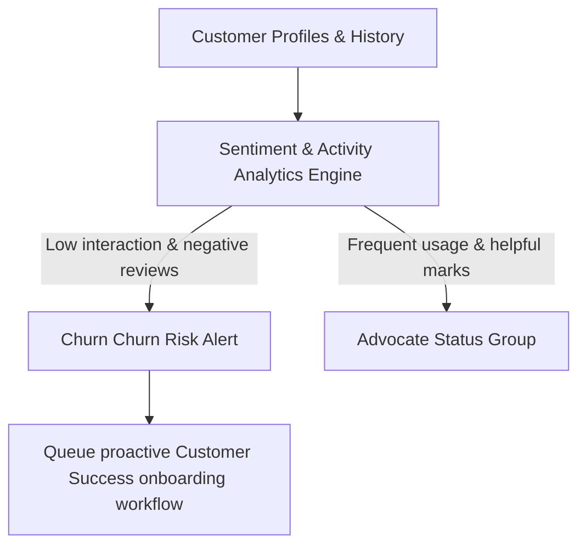

# Aurelia Ops Domain-Specific Improvements & Enterprise Business Capabilities

This document provides the official technical specification for **Aurelia Ops Domain Capabilities**, encompassing advanced Ticket Orchestration, V5 Customer Relations, Workflow Automation Architecture, Knowledge Management models, SLA Controls, and Team Allocation.

---

## 1. Advanced Ticket Lifecycle Management (12.1)

Aurelia Ops v5 enhances helpdesk workflows through modular data structures, flexible schemas, and automated assignment algorithms.

### 1.1 Custom Fields Extensibility Schema
To handle client-specific requirements, tickets support an extensible metadata field mapping to dynamic user types:

```typescript
export interface CustomFieldDefinition {
  id: string;
  workspaceId: string;
  name: string;
  label: string;
  type: "string" | "number" | "boolean" | "date" | "enum";
  options?: string[]; // Presets for enum types
  required: boolean;
}

export interface CustomFieldValue {
  fieldId: string;
  value: string | number | boolean;
}
```

### 1.2 Multi-Agent Auto-Assignment Algorithm
Tickets utilize automated assignment models to distribute workloads safely based on active skills and team capacities:

```typescript
export interface AgentParticipant {
  userId: string;
  skills: string[];
  activeTicketsCount: number;
  maxCapacity: number;
  available: boolean;
}

export function findOptimalAgent(ticket: any, agents: AgentParticipant[]): string | null {
  // Filter active, eligible agents with matching skills
  const eligibleAgents = agents.filter(agent => 
    agent.available && 
    agent.activeTicketsCount < agent.maxCapacity &&
    ticket.requiredSkills.every((skill: string) => agent.skills.includes(skill))
  );

  if (eligibleAgents.length === 0) return null;

  // Assign to the eligible agent with the lowest active workload (Workload Balancing)
  eligibleAgents.sort((a, b) => a.activeTicketsCount - b.activeTicketsCount);
  return eligibleAgents[0].userId;
}
```

---

## 2. Customer Relationship & Churn Analytics (12.2)

V5 elevates CRM interfaces with automated customer sentiment analytics, segmentation capabilities, and lifecycle stage tracking.



- **Communication Sync Engine**: Gathers historical footprints across email, live portal triggers, and API responses. Custom preference schemas assure client communication matches privacy regulations (GDPR, CCPA).
- **Self-Service Portals Integration**: Clients get a customized self-service dashboard to query published articles and evaluate SLA timelines of open tickets.

---

## 3. Workflow Builder & Triggers-Actions Engine (12.3)

Our workflow automation builder uses state-authoritative pipelines to execute dynamic logical operations in response to ticket updates.

### 3.1 Visual Diagram of Execution Pipelines
```
[Event Trigger: e.g. ticket.statusChanged]
               |
               v
       [Load active Rules]
               |
               v
     [Evaluate Conditions] --(Matches)--> [Execute Actions Queue]
               |                                 |
               | (No Match)                      |---> 1. Assign to Tier-2
               v                                 |---> 2. Dispatch Slack Ping
          [Continue]                             |---> 3. Apply Audit Entry
```

### 3.2 Declarative Workflow Payload Specification
Automations are serialized as structured JSON configurations containing recursive evaluation blocks:

```json
{
  "id": "rule-ent-escalate-urgent",
  "name": "Escalate Urgent Enterprise Tickets",
  "trigger": {
    "type": "ticket.created"
  },
  "conditions": {
    "logicalOperator": "AND",
    "rules": [
      { "field": "priority", "operator": "equals", "value": "urgent" },
      { "field": "customer_tier", "operator": "equals", "value": "vip" }
    ]
  },
  "actions": [
    { "type": "assign_to_team", "params": { "teamId": "team-infrastructure-leads" } },
    { "type": "calculate_sla_custom", "params": { "responseTimeMinutes": 15 } },
    { "type": "dispatch_webhook", "params": { "url": "https://hooks.slack.com/services/T00" } }
  ]
}
```

---

## 4. Collaborative Knowledge Management (12.4)

Provides employees with unified publishing models. Features include collaborative article drafting, categorizations, and automated search queries.

- **Markdown Article Editor**: Authors write articles using standard Markdown syntax, utilizing dynamic fields to reference helpdesk ticket examples.
- **Editorial Audit Trails**: Every document transaction (publish, edit, state changes) records historical edits, allowing admins to inspect previous changes or revert to old drafts.

---

## 5. Enterprise SLA Strategy Architectures (12.5)

Our service level engine maps agreement terms dynamically, allowing customers to customize response rules and schedule paused workflows when tickets require feedback.

### 5.1 SLA Calculations Formulation
Target compliance deadlines evaluate core calendar windows. Real metrics ignore non-working hours if configured:

$$\text{Deadline} = \text{Creation\_Timestamp} + \text{Target\_Duration\_Hours} + \delta_{\text{non-working-hours}}$$

### 5.2 Responsive Exceptions & Pause Mechanisms
- **Exemptions Logic**: Sub-sections of tickets (e.g. "Third-party platform service interruptions") bypass SLA tracking via policy exceptions.
- **Pause Triggering**: Transitioning ticket status to `pending` or `waiting-on-client` automatically pauses active timers, preventing false compliance breaches while awaiting client diagnostics.

---

## 6. Capacity Orchestration & Skill Tracking (12.6)

Team dashboards evaluate the capacity, skills profile, and active workload of available helpdesk agents.

- **Skills Profiling**: Agents are tagged with specific areas of expertise (e.g. `postgresql`, `typescript`, `gcp`, `security`).
- **Capacity Management**: Dashboards track active queue depths in real-time, preventing burnouts and informing managers of capacity limits.
