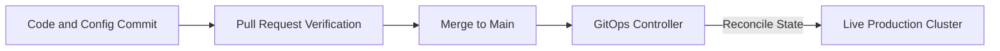

# Aurelia Ops Enterprise Operational Excellence & Disaster Recovery Specification

This document details the official architectural specification for **Aurelia Ops Operational Excellence, Release Engineering, Incident Response, Backup Systems, and Runbooks**. It outlines concrete workflows, targets, and mechanisms for maintaining the highest tier of service availability and operational readiness.

---

## 1. Unified Deployment & Release Engineering (11.1)

Aurelia Ops implements a strict GitOps model coupled with semantic versioning targets (`MAJOR.MINOR.PATCH`) to coordinate high-speed releases without introducing stability regressions.

### 1.1 GitOps & Continuous Delivery Flow
Every change to infrastructure or application code matches state declarations in our core repositories:



- **Declarative Infrastructure**: Cluster states, network policies, and pod placements are declared in dedicated configurations.
- **Automated Rollback Triggers**: Edge telemetry engines monitor HTTP failure counts. If error rates climb past `1.5%` or median latency spikes above `500ms` within the first 5 minutes of a deployment, active routing dynamically rolls back to the previous stable release tag.

### 1.2 Database Migration Coordination
To prevent read/write locks, schema updates follow a safe multi-phase strategy:
1. **Additive Phase**: Apply new columns with default parameters; write queries backward-compatibly.
2. **Data Migration Phase**: Run incremental batch scripts to backfill data fields in the background.
3. **Deprecation Phase**: Re-route application reads and writes exclusively to the new column structures.
4. **Remediation Phase**: Orderly drop or archive legacy columns once dependency usage metrics fall to zero.

---

## 2. Formal Incident Management & Escalation (11.2)

When production service levels diverge from SLA agreements, the platform activates structured incident classification pipelines.

### 2.1 Incident Severity Taxonomy

| Severity Class | Criteria & Scope | Target Response | Target Resolution |
| :--- | :--- | :--- | :--- |
| **SEV 1 - Critical** | Core customer portals completely inaccessible; high rate of transaction write failures. | < 5 Minutes | < 2 Hours |
| **SEV 2 - Major** | SLA Calculations failing or CRM segmentation degraded; core helpdesk remains functional. | < 15 Minutes | < 6 Hours |
| **SEV 3 - Minor** | Localized UI layout abnormalities, slow analytical queries, or low-priority background alerts. | < 2 Hours | < 24 Hours |

### 2.2 Automated On-Call Dispatch Escalation Policy
- **On-Call Management**: Trigger events automatically alert the active primary on-call engineer via phone and PagerDuty integration.
- **Failover Escalation**: If the incident is not acknowledged within `10 minutes`, the alert escalates to the secondary on-call manager.
- **Communication Channel**: Active Slack bridges launch dynamically, appending diagnostic logs and context links directly to the triage thread.

---

## 3. High-Performance Enterprise Backup & DR Systems (11.3)

To ensure a near-zero **Recovery Point Objective (RPO)** and **Recovery Time Objective (RTO)**, physical and logical data copies are synchronized globally.

### 3.1 RTO/RPO Metrics Targets
- **Recovery Point Objective (RPO)**: <= `1 Minute` (achieved via real-time Write-Ahead Logging replication loops).
- **Recovery Time Objective (RTO)**: <= `15 Minutes` (achieved via hot-standby database failovers and automated traffic routes).

### 3.2 Secure Cryptographic Backups Execution
- **Daily Backups Pipeline**:
  - Daily snapshots are compressed and encrypted locally using **AES-256-GCM** keys managed by global hardware security modules (HSMs).
  - Encrypted dump blocks stream securely to multi-region cloud buckets.
- **Automated Restores Verification Drill**:
  - Background processes download daily snapshots into an isolated virtual workspace environment.
  - The worker system boots a transient PostgreSQL cluster, executes full referential assertions, and runs regression queries.
  - If the validation check fails, alerts report snapshot corruption, protecting against silent backup storage failures.

---

## 4. V5-Specific Operational Troubleshooting & Migrations (11.5)

V5 SLA recalculations and automation triggers require specialized administrative runbooks to maintain service continuity during structural updates.

### 4.1 Automation Execution Triage Runbook
- **Incident Description**: An automation rule experiences a run-time execution block or exceeds timeouts, causing tickets to pause.
- **Resolution Directives**:
  1. Inspect the administrative console matching the targeted workflow ID.
  2. Verify if the dynamic execution logs highlight Zod-schema validation issues or parameter mismatches.
  3. Execute the emergency isolation command to skip the failing automation block without halting the core ticket ingestion pipeline:
     ```bash
     npm run cli:worker-skip-automation -- --ruleId=rule-failing-uuid
     ```

### 4.2 SLA Recalculation Fallback Drift Recovery
- **Anomaly**: A change to a global customer Service Level Agreement policy leaves older open tickets with conflicting deadline coordinates.
- **Correction Procedure**:
  - Run the SLA Synchronization script. This recalculates deadlines sequentially across affected tickets while retaining chronological audit logs of the policy changes:
    ```bash
    npm run cli:recalculate-sla -- --workspaceId=ws-active-uuid --since="2026-06-15T00:00:00Z"
    ```
- **Tracking Integrity**: Evaluates history timelines to ensure state changes do not violate historical SLA compliance score metrics.
