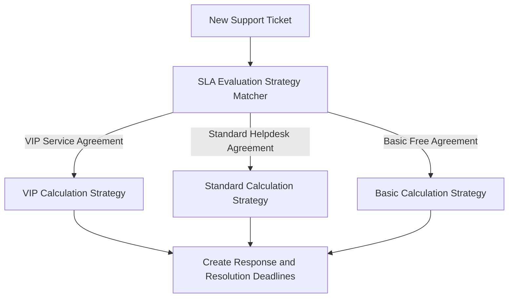
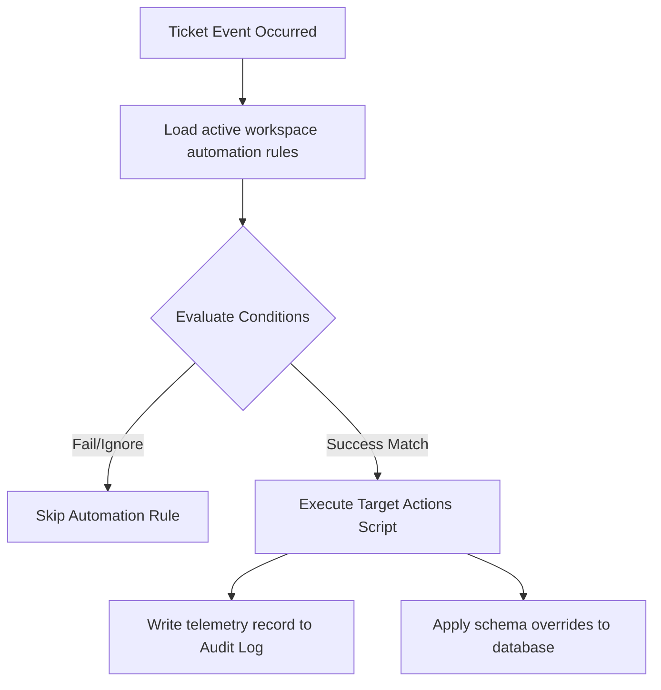

# Aurelia Ops V5 Core Features, SLA Strategies, and Custom Automations

Welcome to the **Aurelia Ops V5 Technical Documentation Suite**. This document outlines the inner workings, database structures, rulesets, and algorithms that power customer segmentation, SLA strategies, knowledge base searching, and automation execution flows.

---

## 1. CRM & Customer Segment Management

Aurelia Ops v5 introduces an advanced customer registry coupled with high-efficiency segmentation capabilities.

### 1.1 Customer Database Fields Schema
Customers map to workspaces and can have multiple emails, phone numbers, source origins, and tags:
```typescript
export interface CustomerEntity {
  id: string;
  workspaceId: string;
  fullName: string;
  customerCompany?: string;
  customerSource?: string; // e.g. "lead", "campaign", "referral"
  createdAt: Date;
  updatedAt: Date;
}
```

### 1.2 Multi-Tier Customer Segmentation
We run dynamic, file-based rulesets on customer attributes to assign accounts to groups. The current segment classification rules mapping matches our localized schema:

```typescript
export const CUSTOMER_SEGMENTS = [
  {
    id: "vip",
    name: "VIP / Enterprise Accounts",
    description: "Matches large accounts or explicitly tagged premium clients",
    matchFn: (cust: any) => {
      const isEnterprise = cust.customer_company?.toLowerCase().includes("enterprise") || 
                           cust.customer_company?.toLowerCase().includes("inc") ||
                           cust.customer_company?.toLowerCase().includes("corp");
      const isVipTag = cust.tags?.some((t: string) => t.toLowerCase() === "vip" || t.toLowerCase() === "premium");
      return !!(isEnterprise || isVipTag);
    }
  },
  {
    id: "new_leads",
    name: "New Leads",
    description: "Freshly introduced client contacts via marketing or landing campaigns",
    matchFn: (cust: any) => {
      return cust.customer_source === "lead" || cust.customer_source === "campaign";
    }
  }
];
```

---

## 2. Advanced SLA Engine Calculations

Aurelia Ops uses the **Strategy Design Pattern** to determine response and resolution deadlines depending on active agreements.



### 2.1 Strategy Policies and Rules
SLA targets calculate two specific timestamps relative to incoming ticket creation:
1. **SLA Response Deadline**: The maximum time permitted to issue a formal agent reply or automatic AI categorization.
2. **SLA Resolution Deadline**: The target threshold within which a ticket status must transition to `resolved` or `closed`.

### 2.2 Core Agreements Matrix
- **Basic SLA Tier** (Default):
  - *Response Target*: 24 hours.
  - *Resolution Target*: 72 hours.
- **Enterprise SLA Tier** (For customers matching VIP Segments):
  - *Response Target*: 30 minutes.
  - *Resolution Target*: 4 hours.

---

## 3. SLA Compliance Reporting & Breach Triggers

To prevent contract violations, the SLA engine maintains active compliance tracking:

1. **SLA Breach Warnings**: When a ticket remains open and the current timestamp approaches `slaResponseDeadline` or `slaResolutionDeadline` by less than 15 minutes, the system marks the ticket `caution`.
2. **Active Breach Flagging**: If the current time exceeds the stored deadline coordinates before an action resolves the request, the database row flags `sla_breached = true`.
3. **Workspace Analytics Grid**: Provides summary cards capturing compliance stats in our dashboard:
   - **Met Percentage**: Total resolutions inside target deadlines vs total tickets.
   - **Active Breach Count**: Open tickets currently violating SLA terms.

---

## 4. Automation Workflow Engine

Our automation system converts manual ticket workflows into instant trigger-action pipelines.

### 4.1 Trigger-Condition-Action (TCA) Architecture
Each automation rule defines:
- **Trigger event**: e.g., `ticket.created`, `ticket.updated`.
- **Conditions array**: e.g., `priority === "urgent"`, `status === "open"`.
- **Actions matrix**: e.g., `assignToUser("usr-infra")`, `addMessage("AI: High priorities alert triggered.")`.

### 4.2 Automation Execution Pipeline Flow
This diagram traces the execution of an automation rule:



---

## 5. Knowledge Base (KB) Architecture & Semantic Search

Aurelia Ops provides employees and clients with instant support answers through our KB engine.

### 5.1 KB Document Schemas
We store articles grouped into categories with clean state workflows:
```typescript
export interface KBArticleEntity {
  id: string;
  workspaceId: string;
  categoryId: string;
  title: string;
  content: string; // Markdown document body
  status: "draft" | "review" | "published";
  createdAt: Date;
  updatedAt: Date;
}
```

### 5.2 Multi-Tier KB Search Functionality
We run high-precision matching when a user queries knowledge base records:
1. **Full-Text Index Lookup (Lexical)**: Executes structured search queries on indexed columns (`title`, `content`) for direct keyword matches.
2. **Semantic Fallback Evaluation**: If lexical queries yield zero results, the system fallback connects to our local vector representations or fuzzy search libraries to map semantic questions to published answer sheets.
3. **Review workflow cycle**: Draft articles are held back and invisible to search engines until reviewers authorize changing status to `published`.
